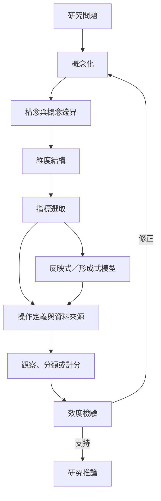

操作化是一組連續的研究決策，而不是單一技術步驟。先由[[概念化]]確定研究對象，再拆解[[構念]]與[[維度]]，選取[[指標]]並制定[[操作定義]]，最後透過[[測量]]與[[效度]]證據檢查推論鏈。

```mermaid
flowchart TD
 A[研究問題] --> B[概念化]
 B --> C[構念與概念邊界]
 C --> D[維度結構]
 D --> E[指標選取]
 E --> F[操作定義與資料來源]
 F --> G[觀察、分類或計分]
 G --> H[效度檢驗]
 H -->|修正| B
 H -->|支持| I[研究推論]
 E --> J[反映式／形成式模型]
 J --> F
```

概念連結：[[操作化]]、[[概念化]]、[[構念]]、[[維度]]、[[指標]]、[[操作定義]]、[[測量]]、[[效度]]、[[反映式指標]]、[[形成式指標]]
