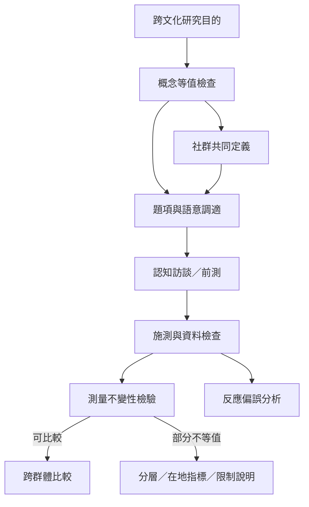

跨文化比較不是把問卷翻譯後就能開始。研究者須檢查[[跨文化調適]]、[[測量不變性]]與[[反應偏誤]]，並讓地方參與概念形成。需要比較的部分可以維持共同量尺，無法等值的面向則以在地補充指標呈現。

```mermaid
flowchart TD
 A[跨文化研究目的] --> B[概念等值檢查]
 B --> C[題項與語意調適]
 C --> D[認知訪談／前測]
 D --> E[施測與資料檢查]
 E --> F[測量不變性檢驗]
 F -->|可比較| G[跨群體比較]
 F -->|部分不等值| H[分層／在地指標／限制說明]
 B --> I[社群共同定義]
 I --> C
 E --> J[反應偏誤分析]
```

概念連結：[[跨文化調適]]、[[測量不變性]]、[[認知訪談]]、[[反應偏誤]]、[[文化效度]]、[[被測量群體應參與定義何謂重要指標]]
