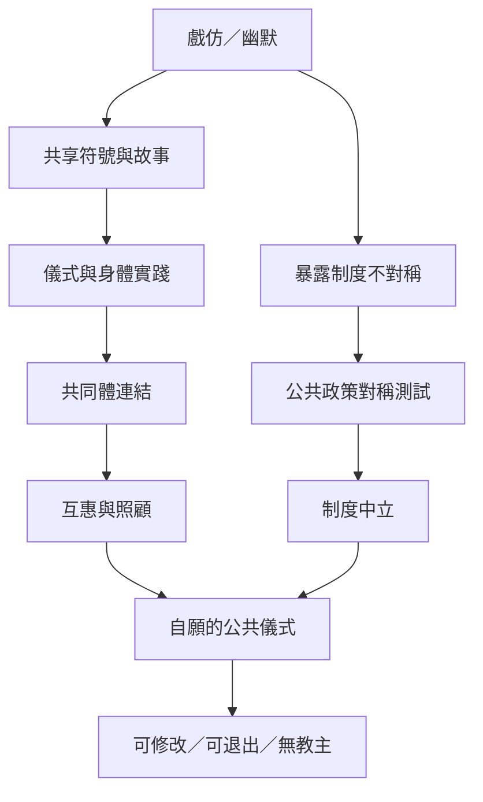

此圖把本書的觀察轉成可用於公共教育、知識共享與共同體活動的設計原則。

```mermaid
graph TD
 A[戲仿／幽默] --> B[暴露制度不對稱]
 A --> C[共享符號與故事]
 C --> D[儀式與身體實踐]
 D --> E[共同體連結]
 B --> F[公共政策對稱測試]
 E --> G[互惠與照顧]
 F --> H[制度中立]
 G --> I[自願的公共儀式]
 H --> I
 I --> J[可修改／可退出／無教主]
```

可實踐筆記：[[以宗教特權對稱測試檢驗公共政策是否中立]]、[[舉辦宗教符號再混成工作坊讓參與者體驗身份如何被組裝]]、[[把知識共享設計成自願互惠的公共儀式]]、[[以原創微型儀式探索不依賴權威的共同體]]。

倫理提醒：[[設計一場不以羞辱信徒為目標的宗教諷刺行動]]、[[讓宗教幽默的風險評估先於公開發布]]。
