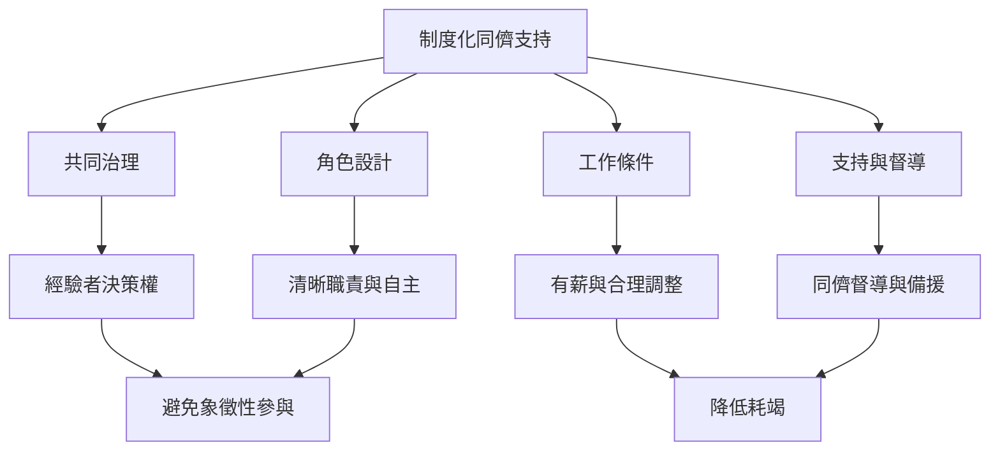

同儕支持進入組織後，關鍵問題不只在工作者能否勝任，也在組織是否願意分享權力、保障勞動條件並承認經驗知識。角色模糊、象徵性參與、低薪、過度情緒勞動與不當界線，都可能削弱服務。

```mermaid
flowchart TD
  A[制度化同儕支持] --> B[共同治理]
  A --> C[工作條件]
  A --> D[角色設計]
  A --> E[支持與督導]
  B --> F[經驗者決策權]
  C --> G[有薪與合理調整]
  D --> H[清晰職責與自主]
  E --> I[同儕督導與備援]
  F --> J[避免象徵性參與]
  G --> K[降低耗竭]
  H --> J
  I --> K
```

此圖連結[[同儕工作者的專業化必須保留經驗知識的自主性]]、[[同儕支持的治理應由經驗者共同制定]]、[[支持者的界線讓關係可以長期持續]]與[[同儕支持不能取代專業服務或制度改革]]。
