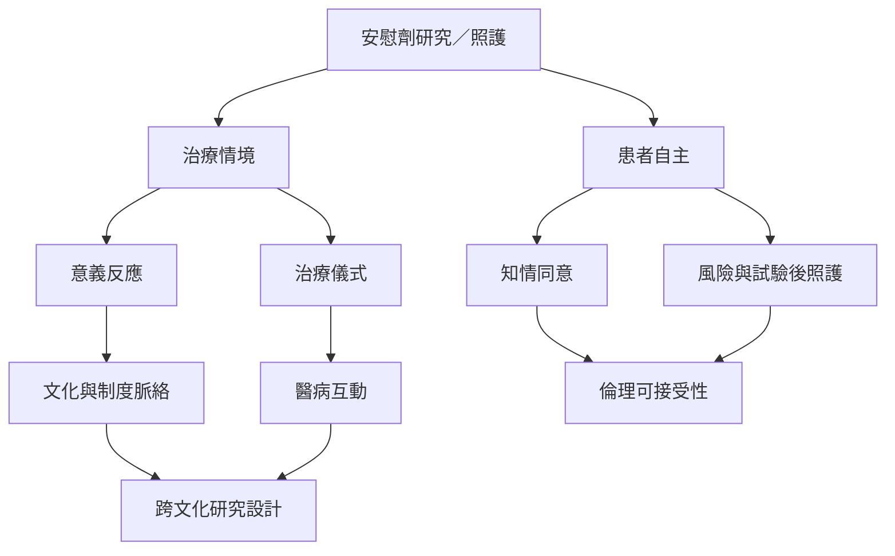

安慰劑研究既是因果推論問題，也是患者自主與文化意義問題。是否使用安慰劑，必須符合 [[知情同意]]、[[研究倫理]] 與避免嚴重或不可逆傷害的要求；同時，治療事件的意義會受到文化與制度信任影響。

```mermaid
flowchart TD
 A[安慰劑研究／照護] --> B[患者自主]
 A --> C[治療情境]
 B --> D[知情同意]
 B --> E[風險與試驗後照護]
 C --> F[意義反應]
 C --> G[治療儀式]
 F --> H[文化與制度脈絡]
 G --> I[醫病互動]
 D --> J[倫理可接受性]
 E --> J
 H --> K[跨文化研究設計]
 I --> K
```

與 [[安慰劑對照必須受到知情同意與風險限制]]、[[跨文化安慰劑研究應比較治療意義而非假設反應普遍相同]] 一起使用。

全書導讀：[[Placebo]]
