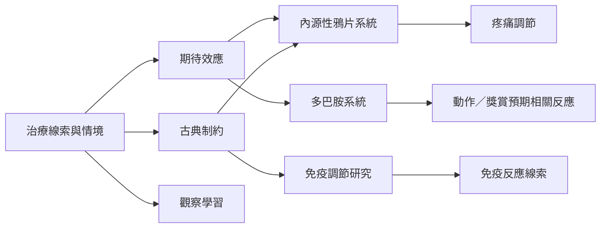

安慰劑研究不只有「相信」一種機制。期待與制約學習可以在不同條件下調動神經調節系統；止痛研究常見 [[內源性鴉片系統]]，帕金森氏症研究則觀察到 [[多巴胺]] 釋放。動物研究也曾探索 [[心理神經免疫學]] 中的學習與免疫連結。

```mermaid
flowchart LR
 A[治療線索與情境] --> B[期待效應]
 A --> C[古典制約]
 A --> D[觀察學習]
 B --> E[內源性鴉片系統]
 C --> E
 B --> F[多巴胺系統]
 C --> G[免疫調節研究]
 E --> H[疼痛調節]
 F --> I[動作／獎賞預期相關反應]
 G --> J[免疫反應線索]
```

解讀時請將單一研究的生理機制限制在它實際研究的疾病與條件內。可連結 [[期待與制約學習是安慰劑效應的兩條重要路徑]]。

全書導讀：[[Placebo]]
