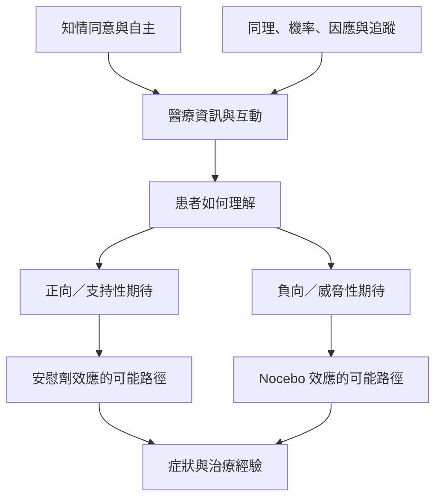

臨床情境可以形成正向或負向期待。良好的溝通不是一味樂觀，而是在透明、比例適當的風險資訊中提供支持與可行行動。[[Nocebo 效應]] 尤其提醒我們，說明副作用時不能只列威脅，也要交代機率、警訊與應對方式。

```mermaid
flowchart TD
 A[醫療資訊與互動] --> B[患者如何理解]
 B --> C[正向／支持性期待]
 B --> D[負向／威脅性期待]
 C --> E[安慰劑效應的可能路徑]
 D --> F[Nocebo 效應的可能路徑]
 E --> G[症狀與治療經驗]
 F --> G
 H[知情同意與自主] --> A
 I[同理、機率、因應與追蹤] --> A
```

可連結 [[風險溝通應同時誠實與支持]]、[[開放標示安慰劑的倫理核心是透明告知而非把病人當成操控對象]]。

全書導讀：[[Placebo]]
