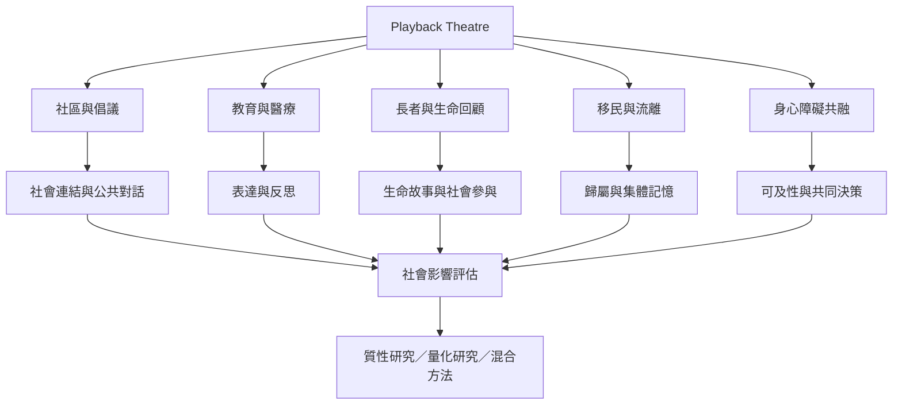

全球 Playback Theatre 的應用涵蓋長者、醫學教育、性別倡議、身心障礙共融、移民記憶、教育與戰爭流離。案例能呈現形式如何在地化；研究則必須追問介入究竟是藝術參與、教育方案、社區工作，還是專業心理治療。

```mermaid
flowchart TD
 A[Playback Theatre] --> B[社區與倡議]
 A --> C[教育與醫療]
 A --> D[長者與生命回顧]
 A --> E[移民與流離]
 A --> F[身心障礙共融]
 B --> G[社會連結與公共對話]
 C --> H[表達與反思]
 D --> I[生命故事與社會參與]
 E --> J[歸屬與集體記憶]
 F --> K[可及性與共同決策]
 G --> L[社會影響評估]
 H --> L
 I --> L
 J --> L
 K --> L
 L --> M[質性研究／量化研究／混合方法]
```

主要概念：[[應用劇場]]、[[社群劇場]]、[[共融設計]]、[[口述歷史]]、[[生命回顧]]、[[實證層級]]、[[社會影響評估]]。
