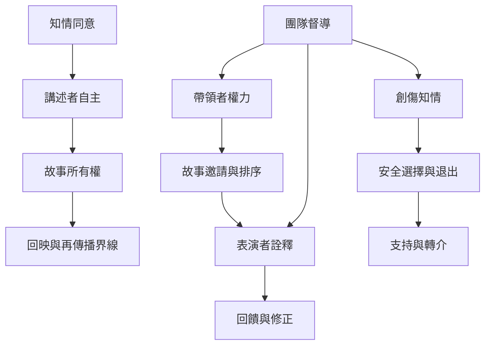

Playback Theatre 的倫理不止在觀眾與講述者之間，也存在於劇團內部、委託機構、表演者與帶領者之間。尊重、同意、可退出、故事再利用風險、能力界線與督導共同構成倫理實踐。

```mermaid
flowchart TD
 A[知情同意] --> B[講述者自主]
 B --> C[故事所有權]
 C --> D[回映與再傳播界線]
 E[帶領者權力] --> F[故事邀請與排序]
 F --> G[表演者詮釋]
 G --> H[回饋與修正]
 I[創傷知情] --> J[安全選擇與退出]
 J --> K[支持與轉介]
 L[團隊督導] --> E
 L --> G
 L --> I
```

主要概念：[[Playback_Theatre實務倫理守則要求尊重包容能力界線與謹慎處理故事]]、[[故事所有權]]、[[知情同意]]、[[權力]]、[[創傷知情實踐]]、[[持續督導]]、[[安全感]]。
