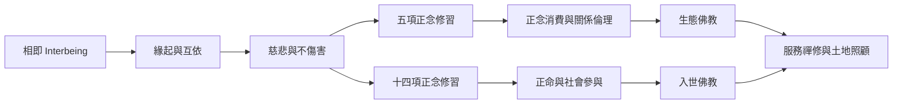

一行禪師的入世佛教把個人修習與社會苦難連結；相即洞見則讓倫理關注從人際關係延伸到工作、消費、社會制度與地球生態。五項及十四項正念修習提供可實踐的行動方向。

```mermaid
flowchart LR
    A[相即 Interbeing] --> B[緣起與互依]
    B --> C[慈悲與不傷害]
    C --> D[五項正念修習]
    C --> E[十四項正念修習]
    D --> F[正念消費與關係倫理]
    E --> G[正命與社會參與]
    F --> H[生態佛教]
    G --> I[入世佛教]
    H --> J[服務禪修與土地照顧]
    I --> J
```

相即不是抽象的整體感，而是辨識關係、影響與責任。延伸概念：[[相即]]、[[入世佛教]]、[[正命]]、[[布施]]、[[生態佛教]]、[[菩薩行]]。另見[[梅村修習系統概念地圖]]。
