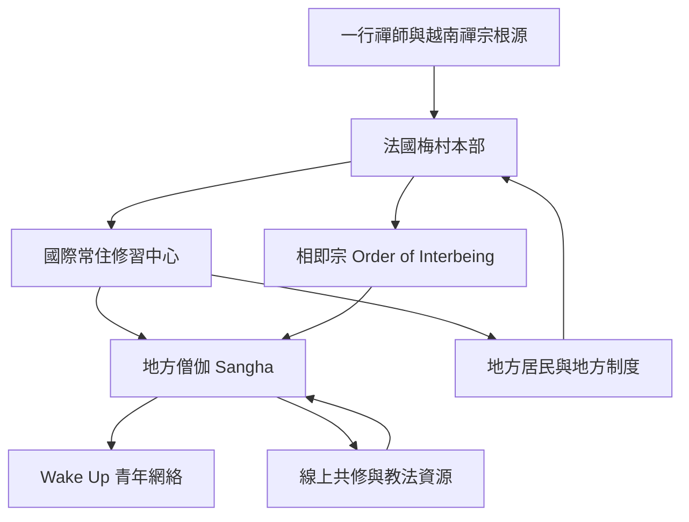

梅村全球網絡由常住道場、僧俗傳承成員、地方僧伽、青年社群及線上資源構成。其運作同時依賴越南禪宗的歷史根源、跨國中心的地方化，以及參與者之間可持續的關係。

```mermaid
flowchart TD
    A[一行禪師與越南禪宗根源] --> B[法國梅村本部]
    B --> C[國際常住修習中心]
    B --> D[相即宗 Order of Interbeing]
    C --> E[地方僧伽 Sangha]
    D --> E
    E --> F[Wake Up 青年網絡]
    E --> G[線上共修與教法資源]
    G --> E
    C --> H[地方居民與地方制度]
    H --> B
```

圖中「全球」不是單向擴散，而是中心、地方居民與修行者互相影響。延伸概念：[[梅村傳統]]、[[僧伽]]、[[相即宗]]、[[實踐社群]]、[[正念旅遊]]、[[深度聆聽]]。另見[[梅村修習系統概念地圖]]。
