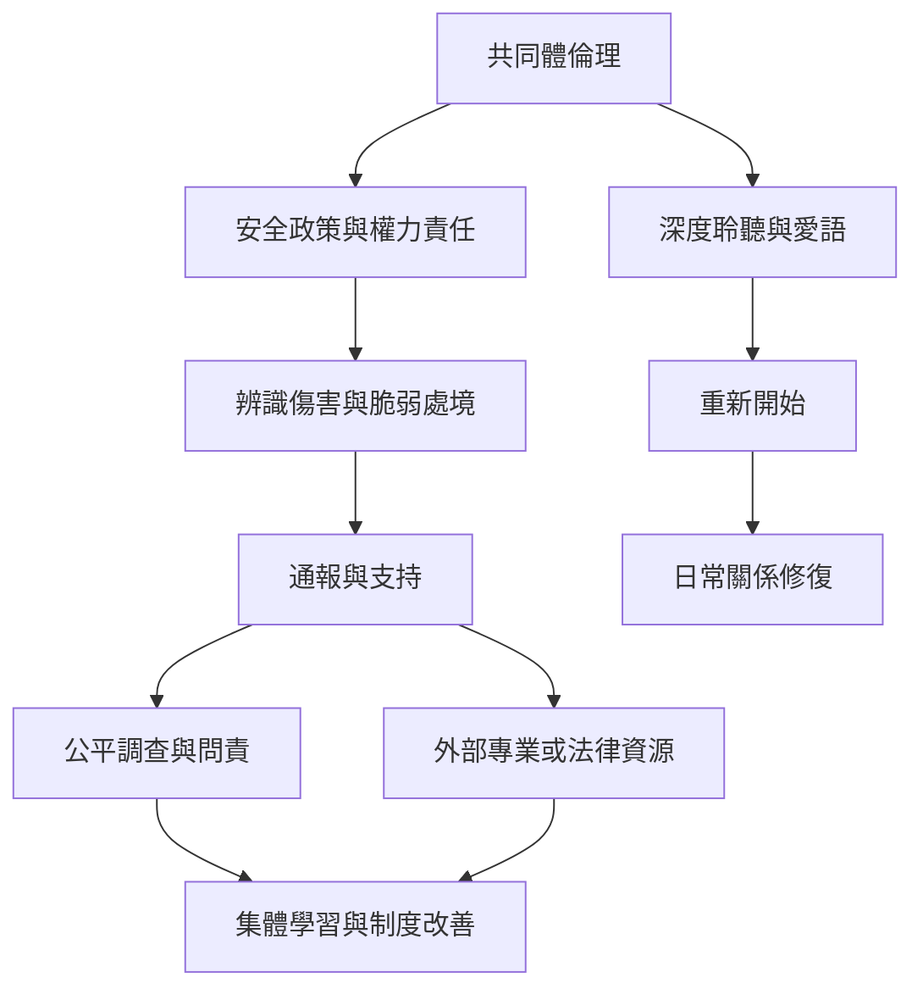

梅村共同體的倫理治理需要把日常修復、正式問責與專業支持區分清楚。重新開始適合可修復的人際摩擦；涉及傷害、權力差異或安全風險時，應優先保障當事人並使用正式通報與回應機制。

```mermaid
flowchart TD
    A[共同體倫理] --> B[深度聆聽與愛語]
    B --> C[重新開始]
    A --> D[安全政策與權力責任]
    D --> E[辨識傷害與脆弱處境]
    E --> F[通報與支持]
    F --> G[公平調查與問責]
    F --> H[外部專業或法律資源]
    C --> I[日常關係修復]
    G --> J[集體學習與制度改善]
    H --> J
```

此圖強調修復性程序不能替代安全保障。延伸概念：[[創傷知情修習]]、[[深度聆聽]]、[[重新開始]]、[[僧伽]]、[[非暴力溝通]]。另見[[梅村修習系統概念地圖]]。
