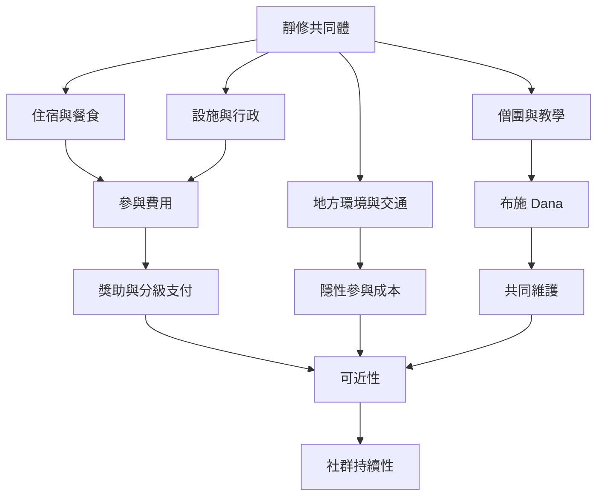

靜修不是脫離經濟條件的純粹精神活動；住宿、飲食、設施、工作人力、交通與捐助都構成修習的物質基礎。付費可能支持組織持續，也可能形成進入門檻，因此需要透明與互惠。

```mermaid
flowchart TD
    A[靜修共同體] --> B[住宿與餐食]
    A --> C[僧團與教學]
    A --> D[設施與行政]
    A --> E[地方環境與交通]
    B --> F[參與費用]
    C --> G[布施 Dana]
    D --> F
    E --> H[隱性參與成本]
    F --> I[獎助與分級支付]
    G --> J[共同維護]
    I --> K[可近性]
    H --> K
    J --> K
    K --> L[社群持續性]
```

討論費用時同時看資源流、照顧勞動與不同參與者的處境。延伸概念：[[布施]]、[[正念旅遊]]、[[實踐社群]]、[[僧伽]]。另見[[全球僧團與地方共修網絡概念地圖]]。
