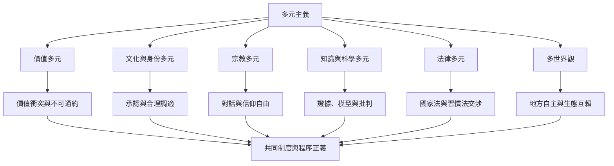

多元主義不是單一學說，而是一組處理差異、共存、衝突與共同規則的研究視角。先辨識多元發生在哪個層次，再研究其正當性與制度安排。

```mermaid
flowchart TD
  P[多元主義] --> V[價值多元]
  P --> C[文化與身份多元]
  P --> R[宗教多元]
  P --> E[知識與科學多元]
  P --> L[法律多元]
  P --> O[多世界觀]
  V --> D[價值衝突與不可通約]
  C --> A[承認與合理調適]
  R --> I[對話與信仰自由]
  E --> S[證據、模型與批判]
  L --> J[國家法與習慣法交涉]
  O --> W[地方自主與生態互賴]
  D --> G[共同制度與程序正義]
  A --> G
  I --> G
  S --> G
  J --> G
  W --> G
```

閱讀時先讀[[多元主義]]與[[多元主義必須先說清楚究竟有什麼東西是多元的]]，再分支閱讀價值、文化、宗教、科學與法律地圖。最後以[[多元主義需要權力分析而不只是善意與包容]]檢視每個案例。
