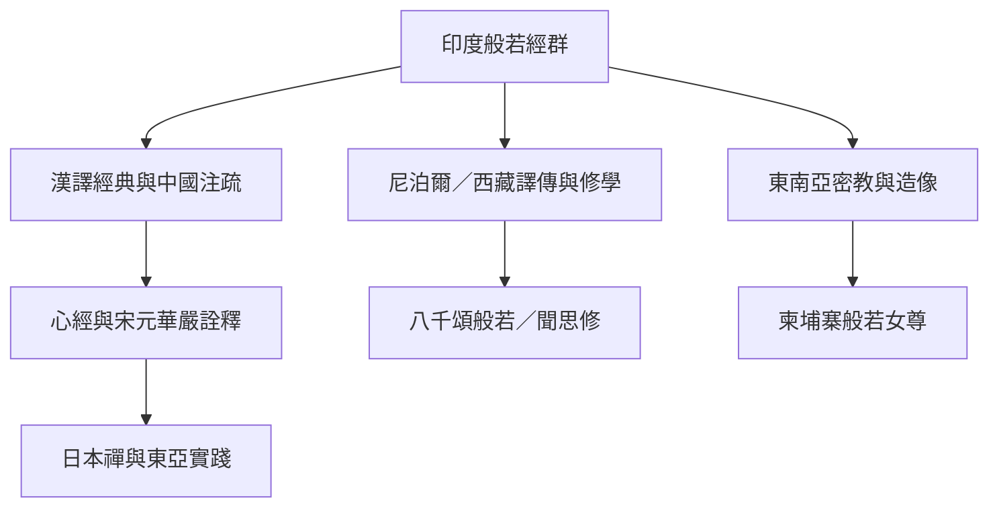

般若波羅蜜多在亞洲的傳播同時包含經典翻譯、哲學注疏、禪修實踐、儀式與造像。不同地區並非被動接收，而是依其語言、制度與文化資源重新塑造般若的意義。

```mermaid
flowchart TD
  A[印度般若經群] --> B[漢譯經典與中國注疏]
  A --> C[尼泊爾／西藏譯傳與修學]
  A --> D[東南亞密教與造像]
  B --> E[心經與宋元華嚴詮釋]
  C --> F[八千頌般若／聞思修]
  D --> G[柬埔寨般若女尊]
  E --> H[日本禪與東亞實踐]
```

文獻卡：[[心經梵文與玄奘譯本可逐句對讀]]、[[宋元華嚴僧侶以二諦與色空不二深化般若詮釋]]、[[柬埔寨高棉密教使般若女尊成為藝術與王權象徵]]、[[八千頌般若提供般若經群的重要早期文本形態]]。
