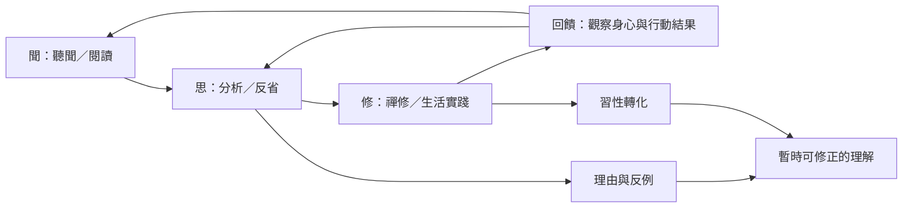

此圖把學習、思考與禪修視為反覆回饋的循環，而非一次完成的線性流程。閱讀提供材料，反省辨別含義，修習檢驗理解是否轉化；經驗再回頭修正閱讀與論證。

```mermaid
flowchart LR
  A[聞：聽聞／閱讀] --> B[思：分析／反省]
  B --> C[修：禪修／生活實踐]
  C --> D[回饋：觀察身心與行動結果]
  D --> B
  D --> A
  B --> E[理由與反例]
  C --> F[習性轉化]
  E --> G[暫時可修正的理解]
  F --> G
```

延伸閱讀：[[智慧必須經過聽聞反省與修習才會成為穩固的理解]]、[[觀察生滅使智慧回到經驗而非抽象信念]]、[[智慧必須同時保有直接經驗推理與謙遜的修正能力]]。
