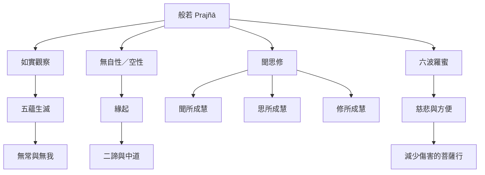

般若的核心問題是：如何從被執取與概念錯認支配的認知，轉向對身心與世界的如實理解，並讓理解轉化成減苦與不害的行動。這張圖把核心智慧、經驗觀察、空性哲學與修行培養放在同一張地圖中。

```mermaid
flowchart TD
  A[般若 Prajñā] --> B[如實觀察]
  A --> C[聞思修]
  A --> D[無自性／空性]
  B --> E[五蘊生滅]
  E --> F[無常與無我]
  D --> G[緣起]
  G --> H[二諦與中道]
  C --> I[聞所成慧]
  C --> J[思所成慧]
  C --> K[修所成慧]
  A --> L[六波羅蜜]
  L --> M[慈悲與方便]
  M --> N[減少傷害的菩薩行]
```

[[般若不是知識堆積而是穿透錯認的解脫智慧]]、[[智慧必須經過聽聞反省與修習才會成為穩固的理解]]、[[空性是否定獨立自性而不是否定因果與倫理]]、[[般若需要慈悲與方便才能成為菩薩行]]構成此圖的四條主軸。
