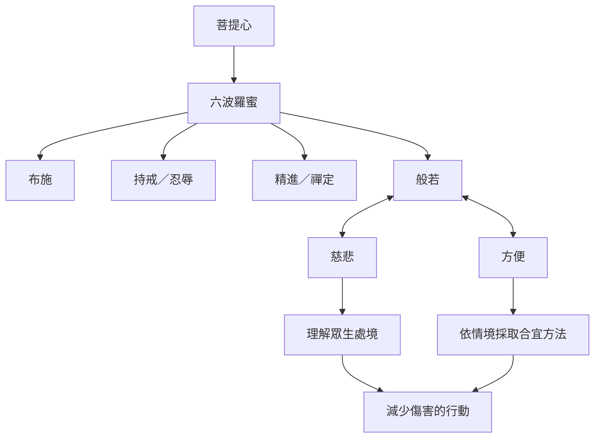

般若在菩薩道中不是遠離關係的純理論，而是與布施、持戒、忍辱、精進、禪定、慈悲、方便及菩提心互相校正。智慧協助辨識條件與執取，慈悲與方便則讓洞察成為對他人有益的回應。

```mermaid
flowchart TD
  A[菩提心] --> B[六波羅蜜]
  B --> C[布施]
  B --> D[持戒／忍辱]
  B --> E[精進／禪定]
  B --> F[般若]
  F <--> G[慈悲]
  F <--> H[方便]
  G --> I[理解眾生處境]
  H --> J[依情境採取合宜方法]
  I --> K[減少傷害的行動]
  J --> K
```

延伸：[[六波羅蜜不是並列清單而是互相校正的修養系統]]、[[般若需要慈悲與方便才能成為菩薩行]]、[[智慧的倫理檢驗是減少傷害而非建立修行者優越感]]。
