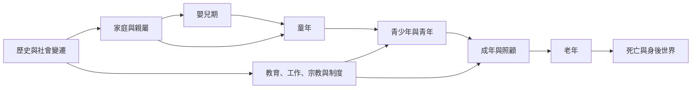

心理發展不是脫離社會的生物時鐘，而是在家庭、同儕、教育、勞動、照顧、宗教、遷移和制度變遷中展開的生命歷程。嬰兒期、童年、青年、成人、老年與臨終階段都需要在具體社會文化情境中理解。

```mermaid
flowchart LR
  A[嬰兒期] --> B[童年]
  B --> C[青少年與青年]
  C --> D[成年與照顧]
  D --> E[老年]
  E --> F[死亡與身後世界]
  G[家庭與親屬] --> A
  G --> B
  H[教育、工作、宗教與制度] --> C
  H --> D
  I[歷史與社會變遷] --> G
  I --> H
```

連結：[[文化模型會提供感知與行動的預設但不會完全決定個體]]、[[個體與文化是在互動中共同形成]]、[[自我是關係與實踐中持續生成的過程]]、[[心理人類學]]。
