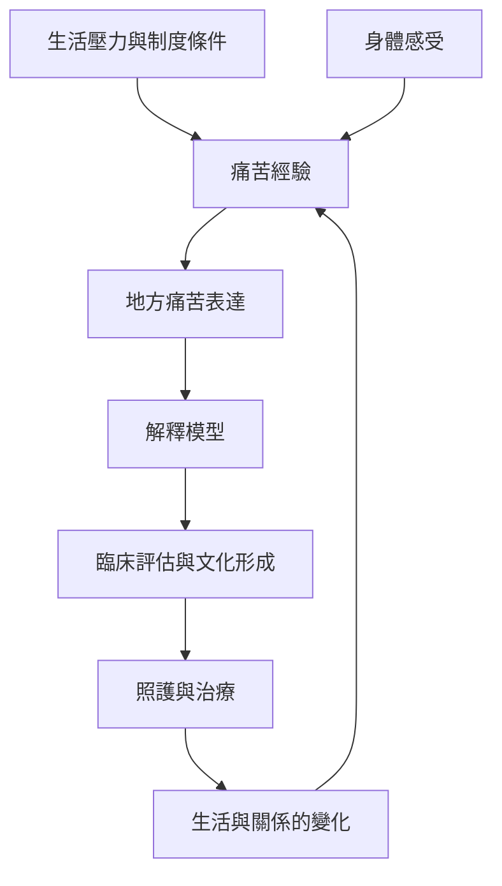

精神困擾和疾病經驗需要同時理解身體症狀、患者的解釋模型、地方痛苦表達、診斷制度與社會生活條件。這張地圖將心理人類學與醫療人類學、精神醫學及文化形成訪談連在一起。

```mermaid
flowchart TD
  A[生活壓力與制度條件] --> B[痛苦經驗]
  C[身體感受] --> B
  D[地方痛苦表達] --> E[解釋模型]
  B --> D
  E --> F[臨床評估與文化形成]
  F --> G[照護與治療]
  G --> H[生活與關係的變化]
  H --> B
```

連結：[[疾病經驗同時包含身體症狀與社會生活困境]]、[[痛苦表達方式是社會共享而非單純個人症狀]]、[[診斷分類需要文化形成而非文化貼標]]、[[解釋模型]]、[[文化形成訪談]]、[[醫療人類學]]。
