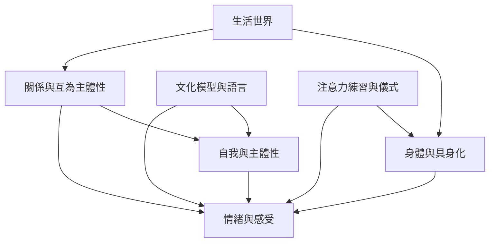

自我、情緒與身體不是互不相干的心理模組；它們透過互動、語言、注意力、感官與生命史交織。從情緒的文化組織與自我形成出發，可以接到具身化、神經人類學、互為主體性與宗教經驗。

```mermaid
flowchart TD
  A[生活世界] --> B[身體與具身化]
  A --> C[關係與互為主體性]
  C --> D[自我與主體性]
  B --> E[情緒與感受]
  C --> E
  D --> E
  F[文化模型與語言] --> D
  F --> E
  G[注意力練習與儀式] --> B
  G --> E
```

連結：[[自我是關係與實踐中持續生成的過程]]、[[情緒是社會關係中的實踐而不只是內在狀態]]、[[情緒詞彙不能直接跨文化等值翻譯]]、[[具身化]]、[[神經人類學]]、[[互為主體性]]、[[道德經驗]]。
