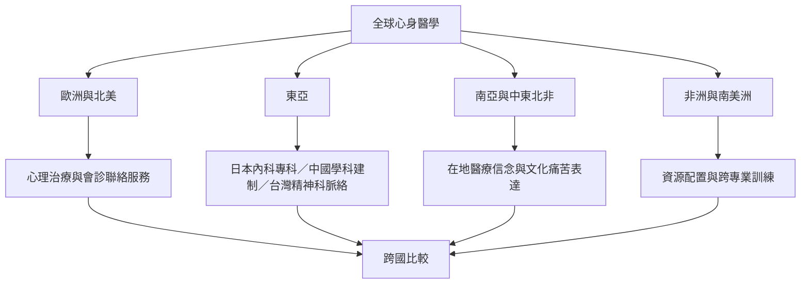

心身醫學的國際發展具有共同問題意識，但各地在專科位置、醫療制度、傳統療癒、文化語彙與服務路徑上差異很大。比較研究應先理解制度，再討論文化和臨床差異。

```mermaid
flowchart TD
  A[全球心身醫學] --> B[歐洲與北美]
  A --> C[東亞]
  A --> D[南亞與中東北非]
  A --> E[非洲與南美洲]
  B --> F[心理治療與會診聯絡服務]
  C --> G[日本內科專科／中國學科建制／台灣精神科脈絡]
  D --> H[在地醫療信念與文化痛苦表達]
  E --> I[資源配置與跨專業訓練]
  F --> J[跨國比較]
  G --> J
  H --> J
  I --> J
```

[[全球心身醫學與會診聯絡精神醫學的比較視角]]提供多國基礎；[[日本心身醫學的制度發展]]、[[中國心身醫學的歷史與學科化]]和[[台灣心身醫學與整合照護現況（2026）]]提供東亞個案。[[文化痛苦表達]]提醒比較時不要把差異本質化。
