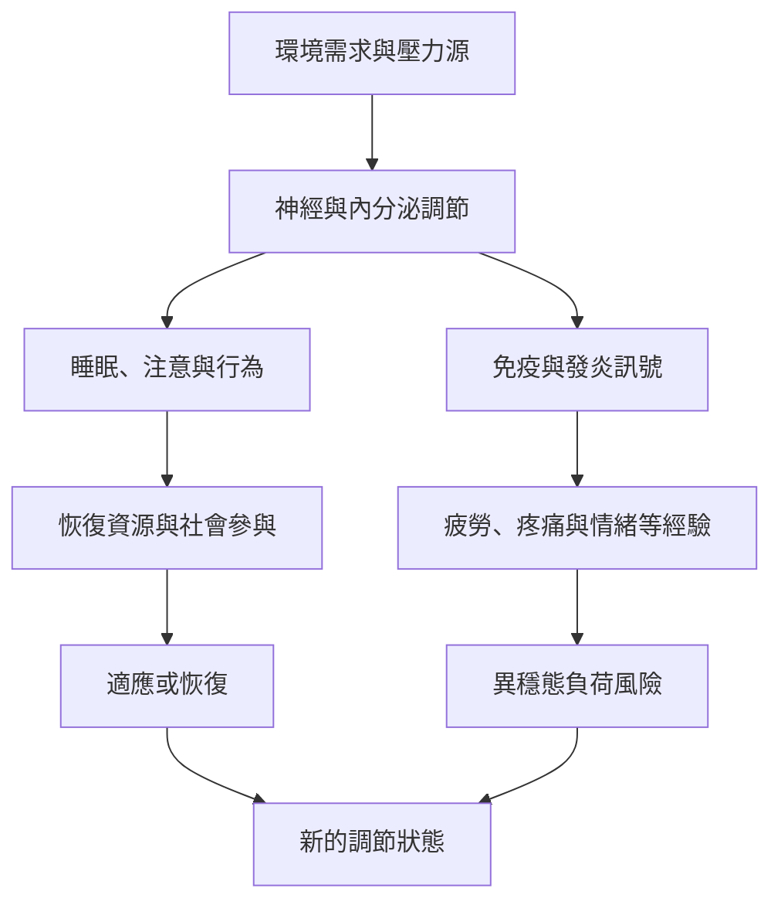

壓力反應會透過神經、內分泌、免疫、睡眠與行為系統調節身體狀態。短期適應與長期負荷需分開理解，不能以單一指標推論個人疾病。

```mermaid
flowchart TD
  A[環境需求與壓力源] --> B[神經與內分泌調節]
  B --> C[睡眠、注意與行為]
  B --> D[免疫與發炎訊號]
  C --> E[恢復資源與社會參與]
  D --> F[疲勞、疼痛與情緒等經驗]
  E --> G[適應或恢復]
  F --> H[異穩態負荷風險]
  G --> I[新的調節狀態]
  H --> I
```

[[異穩態]]描述適應性調節，[[異穩態負荷]]描述長期成本；[[心理神經免疫學]]研究免疫與大腦的雙向溝通。任何模型都要考慮疾病、藥物、工作環境與社會資源。
