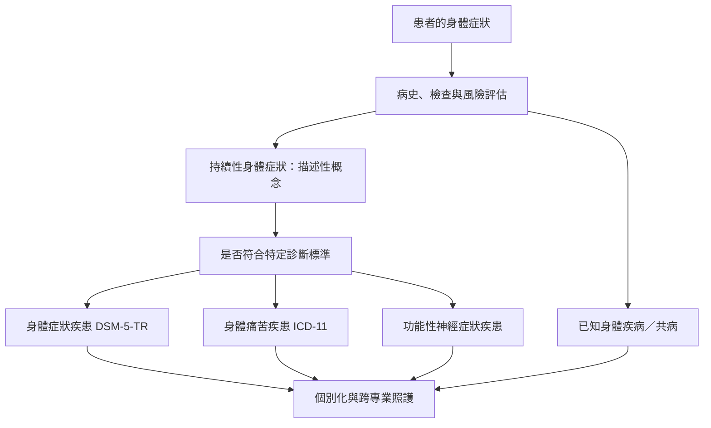

持續性症狀、身體症狀疾患、身體痛苦疾患與功能性神經症狀疾患並非同一層次的概念。先描述症狀與功能，再依各自分類標準考慮診斷，並保留身體疾病的評估與追蹤。

```mermaid
flowchart TD
  A[患者的身體症狀] --> B[病史、檢查與風險評估]
  B --> C[持續性身體症狀：描述性概念]
  C --> D[是否符合特定診斷標準]
  D --> E[身體症狀疾患 DSM-5-TR]
  D --> F[身體痛苦疾患 ICD-11]
  D --> G[功能性神經症狀疾患]
  B --> H[已知身體疾病／共病]
  E --> I[個別化與跨專業照護]
  F --> I
  G --> I
  H --> I
```

[[持續性身體症狀]]是描述性概念；[[身體症狀疾患]]與[[身體痛苦疾患]]是不同分類系統中的診斷；[[功能性神經症狀疾患]]則可透過陽性徵象建立診斷。臨床評估需避免把「病因未明」直接等同心理病因。
