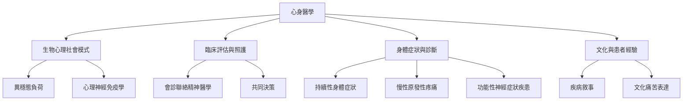

心身醫學位於臨床醫學、精神醫學、心理學、神經科學與社會文化研究的交界。核心不是假設心理因素造成身體病，而是辨識不同層次如何共同影響疾病風險、症狀知覺、治療反應與生活功能。

```mermaid
flowchart TD
  A[心身醫學] --> B[生物心理社會模式]
  A --> C[臨床評估與照護]
  A --> D[身體症狀與診斷]
  A --> E[文化與患者經驗]
  B --> F[異穩態負荷]
  B --> G[心理神經免疫學]
  C --> H[會診聯絡精神醫學]
  C --> I[共同決策]
  D --> J[持續性身體症狀]
  D --> K[慢性原發性疼痛]
  D --> L[功能性神經症狀疾患]
  E --> M[疾病敘事]
  E --> N[文化痛苦表達]
```

進一步理解時，先讀[[心身醫學]]與[[生物心理社會模式]]；再看[[會診聯絡精神醫學]]如何進入醫療制度；最後連接[[疾病敘事]]、[[內感受]]與[[異穩態負荷]]，避免把身心互動縮減成單一病因。
