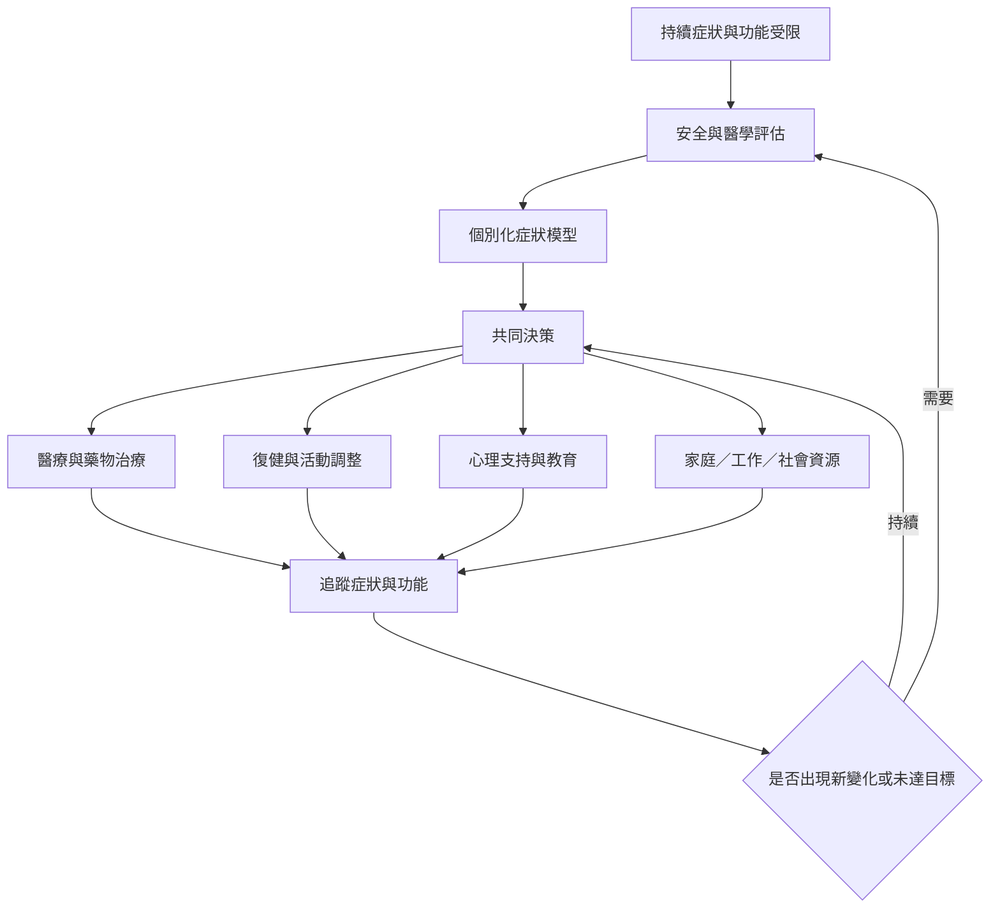

慢性疼痛與功能性神經症狀可能影響活動、睡眠、工作、人際關係和自我理解。照護的共同原則是承認症狀真實、提供清楚解釋、處理共病、協助功能恢復，並以患者生活目標作為共同方向。

```mermaid
flowchart TD
  A[持續症狀與功能受限] --> B[安全與醫學評估]
  B --> C[個別化症狀模型]
  C --> D[共同決策]
  D --> E[醫療與藥物治療]
  D --> F[復健與活動調整]
  D --> G[心理支持與教育]
  D --> H[家庭／工作／社會資源]
  E --> I[追蹤症狀與功能]
  F --> I
  G --> I
  H --> I
  I --> J{是否出現新變化或未達目標}
  J -->|需要| B
  J -->|持續| D
```

[[慢性原發性疼痛]]不等於心理性疼痛；[[功能性神經症狀疾患]]不等於裝病。[[醫療溝通本身會成為治療情境的一部分]]，因此解釋、信任與照護連續性也是實際介入。
