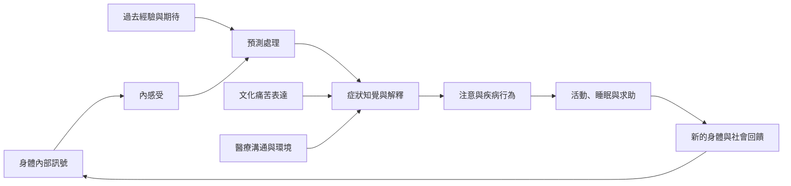

症狀經驗是身體訊號、注意、預期、情境與生活意義共同形成的過程。這張地圖聚焦生理訊號如何被感知、解釋並回饋到行為。

```mermaid
flowchart LR
  A[身體內部訊號] --> B[內感受]
  C[過去經驗與期待] --> D[預測處理]
  B --> D
  D --> E[症狀知覺與解釋]
  F[文化痛苦表達] --> E
  G[醫療溝通與環境] --> E
  E --> H[注意與疾病行為]
  H --> I[活動、睡眠與求助]
  I --> J[新的身體與社會回饋]
  J --> A
```

[[內感受]]與[[預測處理]]是理解症狀知覺的研究概念；[[安慰劑效應]]和[[反安慰劑效應]]呈現期待與情境的調節作用。這些理論不應用來否定症狀的生理性或患者敘事。
