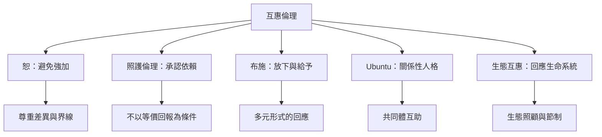

互惠倫理不只是追求等價回報。它還必須處理照護關係的不對稱、個體差異、宗教贈與、共同體責任，以及人類對其他生命與土地的依賴。

```mermaid
flowchart TD
    A[互惠倫理] --> B[恕：避免強加]
    A --> C[照護倫理：承認依賴]
    A --> D[布施：放下與給予]
    A --> E[Ubuntu：關係性人格]
    A --> F[生態互惠：回應生命系統]
    B --> G[尊重差異與界線]
    C --> H[不以等價回報為條件]
    D --> I[多元形式的回應]
    E --> J[共同體互助]
    F --> K[生態照顧與節制]
```

概念連結：[[互惠]]、[[恕]]、[[照護倫理]]、[[布施]]、[[Ubuntu]]、[[互助]]、[[無條件給予]]。
