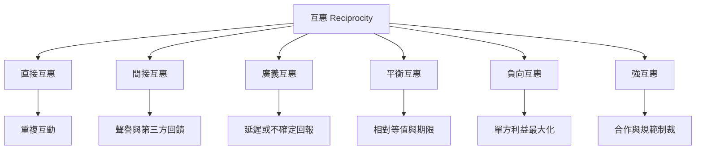

互惠研究首先要問：誰回應誰、回報何時發生、是否要求等值、是否由第三方承接。不同機制可以並存，不宜將它們視為彼此完全互斥的自然種類。

```mermaid
flowchart TD
    A[互惠 Reciprocity] --> B[直接互惠]
    A --> C[間接互惠]
    A --> D[廣義互惠]
    A --> E[平衡互惠]
    A --> F[負向互惠]
    A --> G[強互惠]
    B --> H[重複互動]
    C --> I[聲譽與第三方回饋]
    D --> J[延遲或不確定回報]
    E --> K[相對等值與期限]
    F --> L[單方利益最大化]
    G --> M[合作與規範制裁]
```

概念連結：[[互惠]]、[[直接互惠]]、[[間接互惠]]、[[廣義互惠]]、[[平衡互惠]]、[[負向互惠]]、[[強互惠]]、[[互惠利他]]、[[互惠規範]]。
