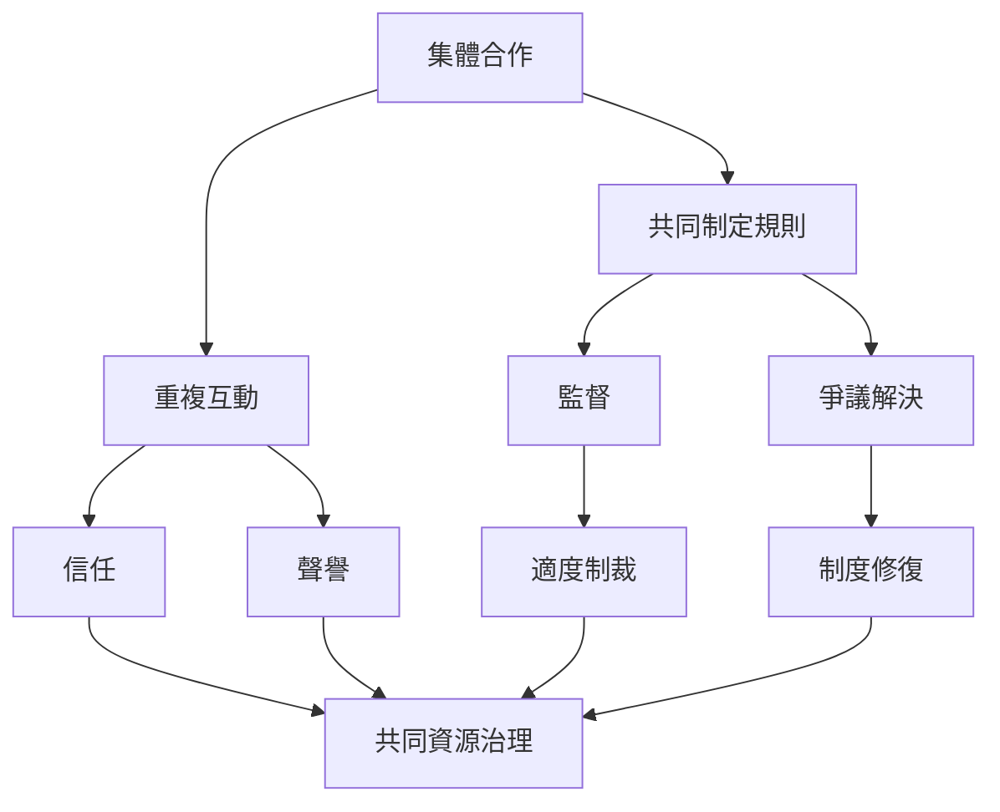

合作不只依賴個人善意，還依賴重複互動、聲譽資訊、共同規則與公平執行。這些條件可以支持共同資源治理，但必須接受參與者監督與制度修正。

```mermaid
flowchart TD
    A[集體合作] --> B[重複互動]
    A --> C[共同制定規則]
    B --> D[信任]
    B --> E[聲譽]
    C --> F[監督]
    C --> G[爭議解決]
    F --> H[適度制裁]
    G --> I[制度修復]
    D --> J[共同資源治理]
    E --> J
    H --> J
    I --> J
```

概念連結：[[互惠]]、[[信任]]、[[聲譽]]、[[共同資源]]、[[共同資源治理]]、[[互助]]、[[時間銀行]]、[[互惠規範]]。
