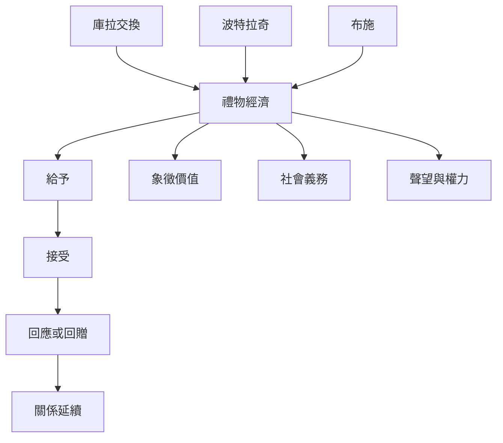

禮物不是孤立的物件，而是嵌入關係與歷史的社會行動。它能創造信任、跨群體往來與資源分配，也可能製造人情債、競爭與階序。

```mermaid
flowchart TD
    A[禮物經濟] --> B[給予]
    B --> C[接受]
    C --> D[回應或回贈]
    D --> E[關係延續]
    A --> F[象徵價值]
    A --> G[社會義務]
    A --> H[聲望與權力]
    I[庫拉交換] --> A
    J[波特拉奇] --> A
    K[布施] --> A
```

概念連結：[[互惠]]、[[禮物經濟]]、[[庫拉交換]]、[[波特拉奇]]、[[布施]]、[[無條件給予]]、[[社會交換理論]]。
