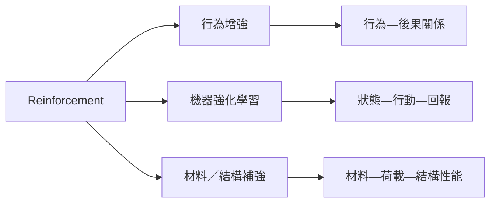

同一個英文詞可指稱不同學科機制。行為科學以行為變化定義增強；機器學習以回報訊號更新策略；工程學以材料補強承受荷載。跨領域比較可以啟發思考，但不可將三種定義合併為單一理論。

```mermaid
graph LR
  R[Reinforcement] --> B[行為增強]
  R --> M[機器強化學習]
  R --> E[材料／結構補強]
  B --> B1[行為—後果關係]
  M --> M1[狀態—行動—回報]
  E --> E1[材料—荷載—結構性能]
```

連結：[[增強（心理學）]]、[[強化學習]]、[[結構補強]]、[[相同的reinforcement在行為科學人工智慧與工程中不可直接互換]]。
