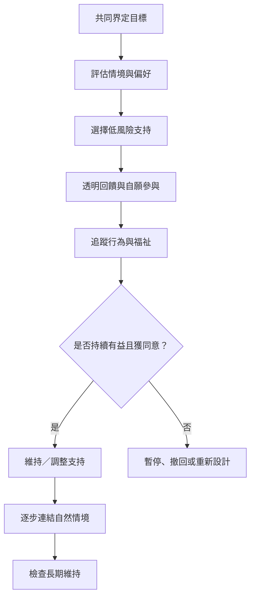

增強方案需要同時問「是否有效」與「是否正當」。倫理設計需讓當事人參與目標設定、理解程序、保有選擇與撤回權，並檢查資源不平等、長期維持、非預期副作用與自然情境的適用性。

```mermaid
graph TD
  A[共同界定目標] --> B[評估情境與偏好]
  B --> C[選擇低風險支持]
  C --> D[透明回饋與自願參與]
  D --> E[追蹤行為與福祉]
  E --> F{是否持續有益且獲同意？}
  F -->|是| G[維持／調整支持]
  F -->|否| H[暫停、撤回或重新設計]
  G --> I[逐步連結自然情境]
  I --> J[檢查長期維持]
```

連結：[[倫理的增強設計必須保留同意選擇與退出權]]、[[自主勝任與關係感讓動機支持不只依賴外在獎勵]]、[[短期行為改變不能直接推論長期動機已經內化]]、[[自然情境中的回饋比持續外加獎品更有助於維持習慣]]。
