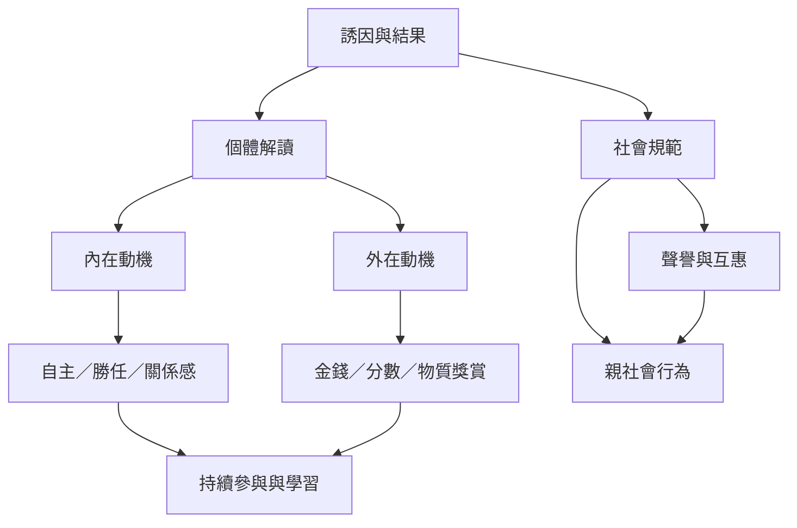

增強與誘因的效果取決於人的需要、偏好、社會關係與文化脈絡。外在獎賞可能控制行為，也可能提供能力資訊；自主、勝任與關係感會改變其動機意義。親社會行為還受聲譽、規範與互惠機制調節。

```mermaid
graph TD
  A[誘因與結果] --> B[個體解讀]
  B --> C[內在動機]
  B --> D[外在動機]
  C --> E[自主／勝任／關係感]
  D --> F[金錢／分數／物質獎賞]
  A --> G[社會規範]
  G --> H[聲譽與互惠]
  G --> I[親社會行為]
  E --> J[持續參與與學習]
  F --> J
  H --> I
```

此圖用來提出分析問題，不表示所有社會情境都遵循相同因果路徑。

連結：[[內在動機]]、[[外在動機]]、[[社會增強]]、[[社會規範]]、[[替代增強]]、[[獎賞不等於增強而愉快也不是唯一學習訊號]]。
