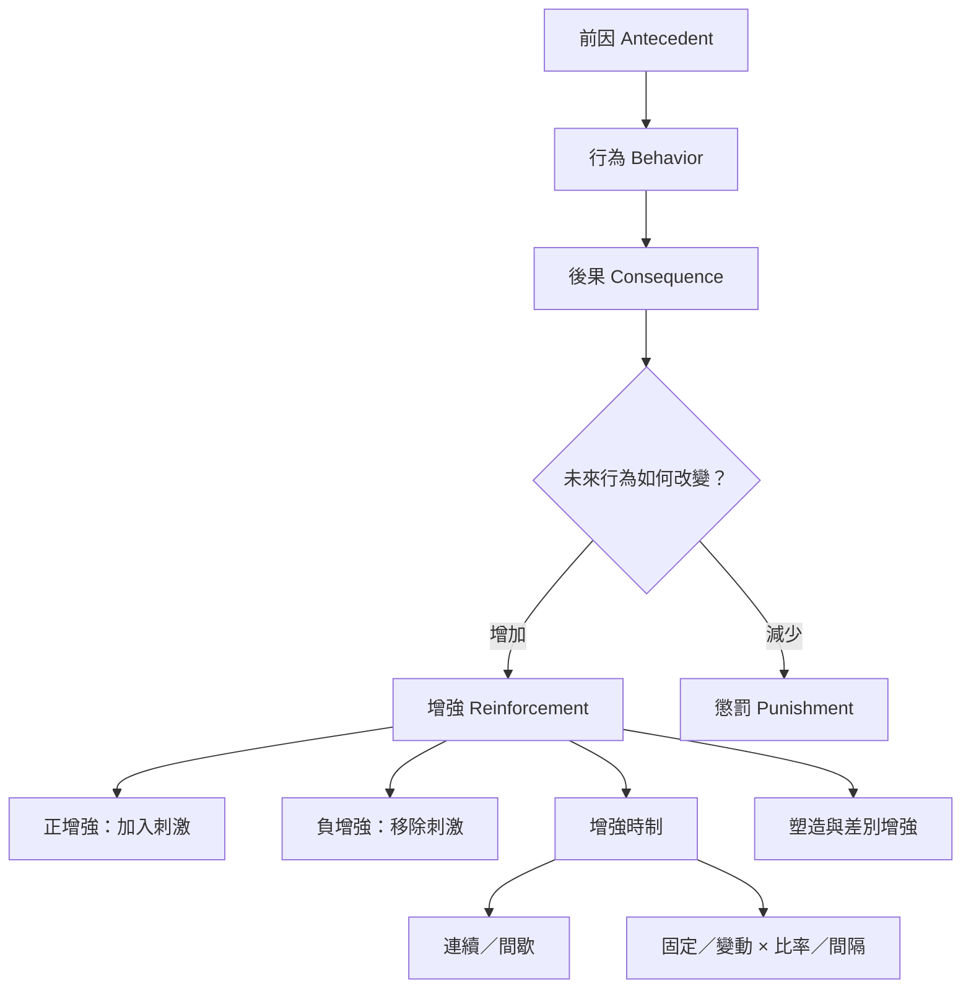

行為分析以可觀察的前因、行為與後果形成分析起點。後果只有在改變未來行為時才是增強；正負增強描述刺激加入或移除，懲罰則以行為減少為結果。時制、塑造與差別增強進一步說明行為如何建立與維持。

```mermaid
graph TD
  A[前因 Antecedent] --> B[行為 Behavior]
  B --> C[後果 Consequence]
  C --> D{未來行為如何改變？}
  D -->|增加| E[增強 Reinforcement]
  D -->|減少| F[懲罰 Punishment]
  E --> G[正增強：加入刺激]
  E --> H[負增強：移除刺激]
  E --> I[增強時制]
  I --> J[連續／間歇]
  I --> K[固定／變動 × 比率／間隔]
  E --> L[塑造與差別增強]
```

此圖是概念關係圖，不代表每次行為都可由單一線性原因解釋。

連結：[[增強（心理學）]]、[[操作制約]]、[[正增強]]、[[負增強]]、[[懲罰]]、[[增強時制]]、[[塑造]]、[[差別增強]]。
