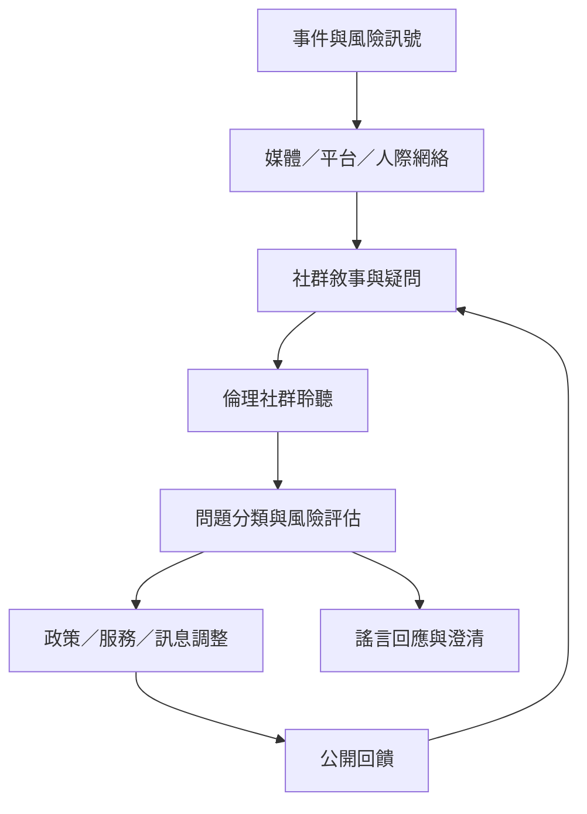

數位平台使風險資訊傳播更快速，也讓機構有機會聽見受眾問題。社群聆聽應以理解和改善為目的，並遵守隱私、人權及比例原則；回應錯誤資訊時要先評估危害與放大效應。

```mermaid
flowchart TD
  A[事件與風險訊號] --> B[媒體／平台／人際網絡]
  B --> C[社群敘事與疑問]
  C --> D[倫理社群聆聽]
  D --> E[問題分類與風險評估]
  E --> F[政策／服務／訊息調整]
  F --> G[公開回饋]
  G --> C
  E --> H[謠言回應與澄清]
```

核心筆記：[[社群聆聽能把受眾疑問轉化為可回應的公共知識]]、[[危機謠言回應應先評估傷害再決定是否放大討論]]、[[媒體與人際網絡會共同塑造風險資訊環境]]。

本圖屬於[[Risk_communication]]。
