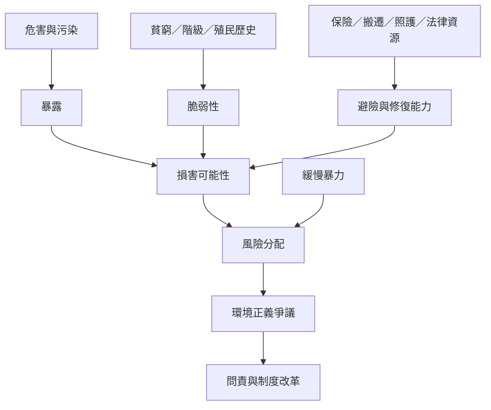

風險的分布不只由危害本身決定，也由暴露位置、脆弱性、階級與制度保護能力塑造。環境正義要求同時檢視污染負擔、收益分配、決策參與及修復責任；緩慢暴力則指出長期而不易察覺的傷害如何被忽視。

```mermaid
flowchart TD
 A[危害與污染] --> B[暴露]
 B --> C[損害可能性]
 D[貧窮／階級／殖民歷史] --> E[脆弱性]
 E --> C
 F[保險／搬遷／照護／法律資源] --> G[避險與修復能力]
 G --> C
 C --> H[風險分配]
 H --> I[環境正義爭議]
 J[緩慢暴力] --> H
 I --> K[問責與制度改革]
```

連結：[[風險分配]]、[[脆弱性]]、[[暴露]]、[[環境正義]]、[[緩慢暴力]]、[[風險社會]]。

回到導讀：[[Risk_society]]。
