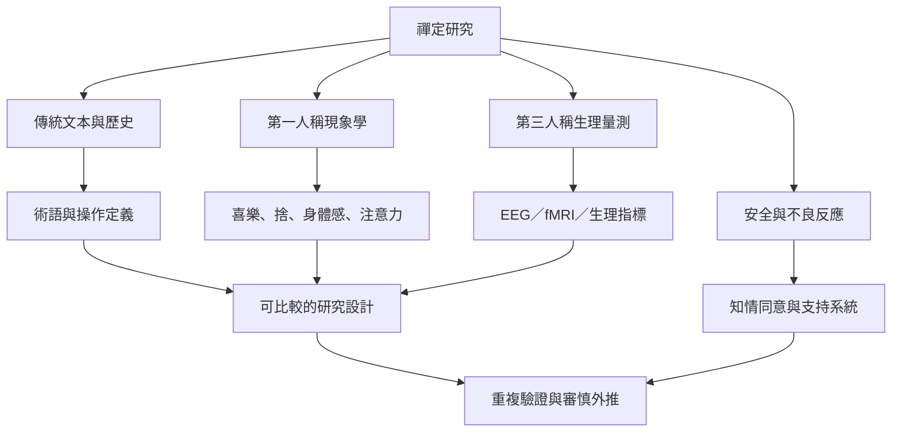

此圖串連古典術語、第一人稱經驗與現代研究。研究核心問題包括：如何定義高階禪那、如何同步記錄經驗與神經資料、如何處理個案外推，以及如何把困難經驗與安全支持納入研究倫理。

```mermaid
flowchart TD
  A[禪定研究] --> B[傳統文本與歷史]
  A --> C[第一人稱現象學]
  A --> D[第三人稱生理量測]
  A --> E[安全與不良反應]
  B --> F[術語與操作定義]
  C --> G[喜樂、捨、身體感、注意力]
  D --> H[EEG／fMRI／生理指標]
  F --> I[可比較的研究設計]
  G --> I
  H --> I
  E --> J[知情同意與支持系統]
  I --> K[重複驗證與審慎外推]
  J --> K
```

## 概念連結

* [[禪定研究必須先釐清術語與操作定義]]
* [[高階禪定研究需要結合第一人稱經驗與神經資料]]
* [[單一高階禪修個案不能代表所有禪那經驗]]
* [[禪修可能出現困難經驗而需要支持系統]]
