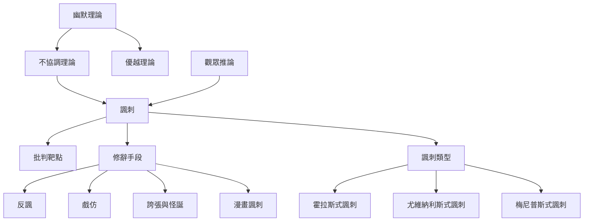

這張地圖整理諷刺與相鄰概念的層次：諷刺是帶有批判目的的表現模式，可能運用反諷、戲仿、誇張與漫畫等手段；觀眾則透過不協調與語境推斷辨認批判。

```mermaid
flowchart TD
 A[諷刺] --> B[批判靶點]
 A --> C[修辭手段]
 C --> D[反諷]
 C --> E[戲仿]
 C --> F[誇張與怪誕]
 C --> G[漫畫諷刺]
 A --> H[諷刺類型]
 H --> I[霍拉斯式諷刺]
 H --> J[尤維納利斯式諷刺]
 H --> K[梅尼普斯式諷刺]
 L[幽默理論] --> M[不協調理論]
 L --> N[優越理論]
 M --> A
 O[觀眾推論] --> A
```

延伸：[[諷刺]]、[[反諷]]、[[戲仿]]、[[挖苦]]、[[霍拉斯式諷刺]]、[[尤維納利斯式諷刺]]、[[梅尼普斯式諷刺]]、[[不協調理論]]、[[諷刺的批判力來自讓制度自我描述與實際行為正面相撞]]。

本書脈絡：[[Satire]]。
