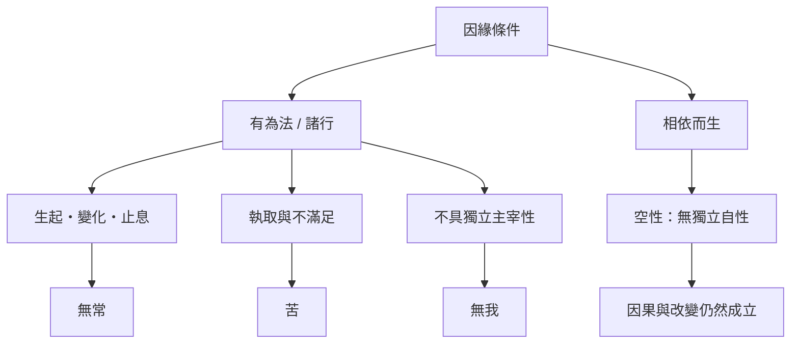

「諸行無常」從有為現象的變化性切入；「諸法無我」則指出不應把任何身心現象當成獨立、恆常的主體。中觀以無自性深化條件依存的哲學分析，但空性不否定世俗因果。

```mermaid
flowchart TD
    A[因緣條件] --> B[有為法 / 諸行]
    B --> C[生起・變化・止息]
    C --> D[無常]
    B --> E[執取與不滿足]
    E --> F[苦]
    B --> G[不具獨立主宰性]
    G --> H[無我]
    A --> I[相依而生]
    I --> J[空性：無獨立自性]
    J --> K[因果與改變仍然成立]
```

延伸連結：[[有為法]]、[[無常（anicca）]]、[[苦（dukkha）]]、[[無我（anattā）]]、[[空性（śūnyatā）]]、[[諸行無常與諸法無我具有不同的論述範圍]]、[[空性否定獨立自性而不是否定因果作用]]。
