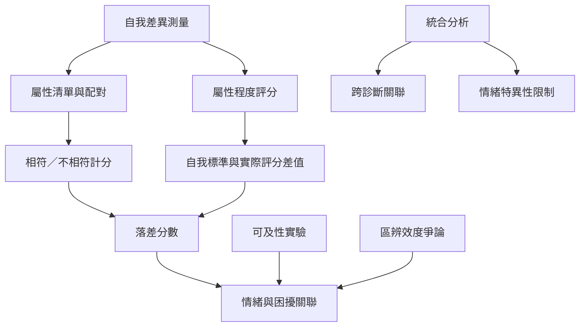

自我差異的實證研究包含屬性清單、程度評分、實驗啟動與統合分析。讀研究時應同時檢查構念如何被操作化、落差類型能否區辨、樣本與情境是否足夠，以及結果是相關還是因果。

```mermaid
graph TD
  A[自我差異測量] --> B[屬性清單與配對]
  A --> C[屬性程度評分]
  B --> D[相符／不相符計分]
  C --> E[自我標準與實際評分差值]
  D --> F[落差分數]
  E --> F
  F --> G[情緒與困擾關聯]
  H[可及性實驗] --> G
  I[區辨效度爭論] --> G
  J[統合分析] --> K[跨診斷關聯]
  J --> L[情緒特異性限制]
```

核心方法來源：[[自我差異的測量必須說明屬性如何配對與計分]]；方法論辯論：[[不同自我差異類型的情緒特異性仍有方法論爭論]]；整體證據：[[自我差異與心理病理的統合分析支持跨診斷關聯但弱化情緒特異性]]。
