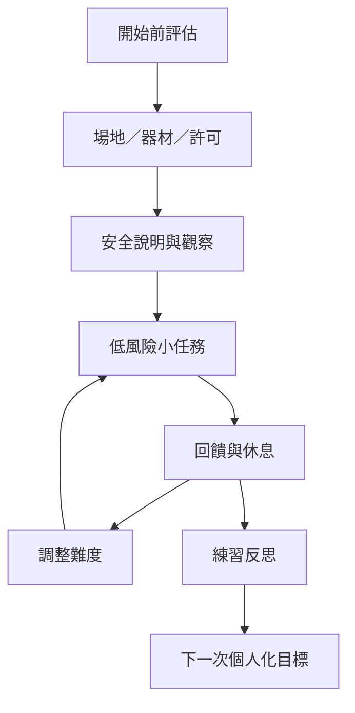

初學者課程的核心不是讓人盡快走完整條線，而是在適合場地中，透過漸進任務、清楚回饋、同伴照看與風險辨識，逐步理解身體與織帶如何互相影響。

```mermaid
flowchart TD
    A[開始前評估] --> B[場地／器材／許可]
    B --> C[安全說明與觀察]
    C --> D[低風險小任務]
    D --> E[回饋與休息]
    E --> F[調整難度]
    F --> D
    E --> G[練習反思]
    G --> H[下一次個人化目標]
```

本地延伸閱讀：[[初學者的微小任務比追求長時間站立更適合建立技能]]、[[建立以新手為中心的扁帶安全入門手冊]]、[[在台灣建立以公園共存為核心的扁帶入門聚會]]、[[漸進式練習]]、[[回饋學習]]、[[安全設計]]。
