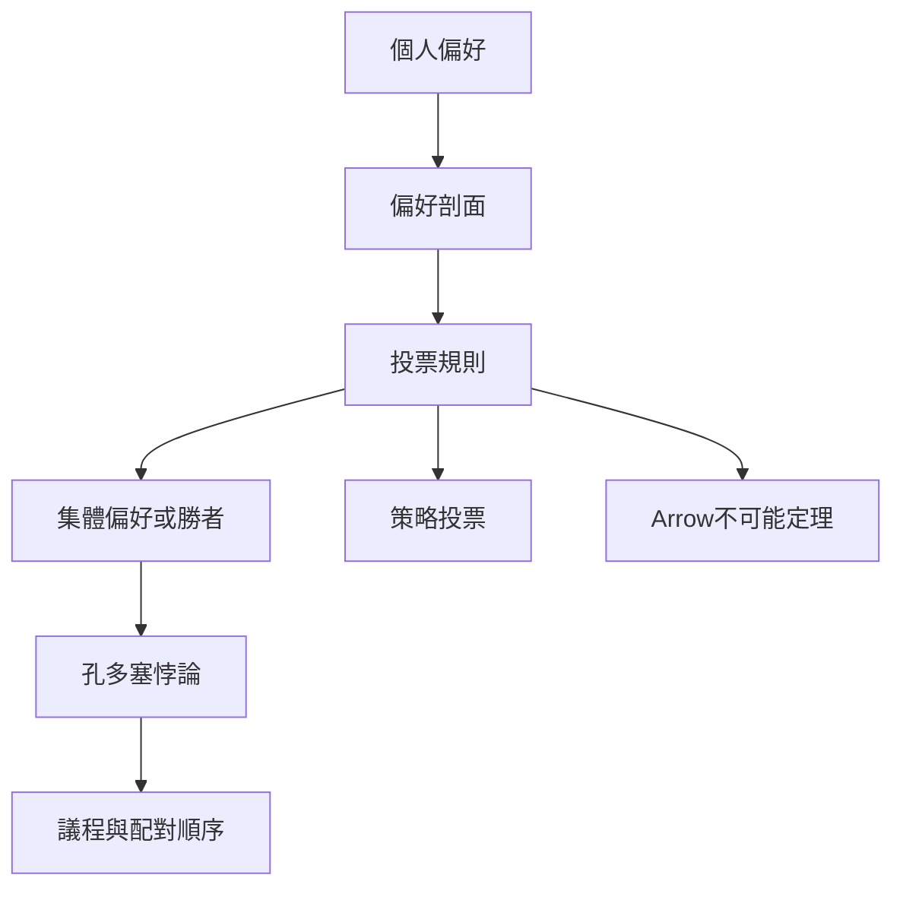

本概念地圖整理個人偏好如何透過投票規則轉化成集體排序，以及不同規則如何保留或捨棄資訊。它連接偏好輸入、聚合方法、循環問題與策略性反應。

```mermaid
flowchart TD
    A[個人偏好] --> B[偏好剖面]
    B --> C[投票規則]
    C --> D[集體偏好或勝者]
    C --> E[策略投票]
    D --> F[孔多塞悖論]
    F --> G[議程與配對順序]
    C --> H[Arrow不可能定理]
```

[[社會選擇理論把個人意見轉化為集體結果]]、[[偏好表達方式會改變集體選擇看得見的資訊]]、[[孔多塞悖論顯示多數偏好可能形成循環]]、[[策略性投票使選民可能不願如實表達偏好]]、[[集體決策規則同時是技術安排與價值選擇]]。
