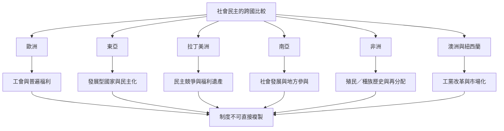

不同地區的社會政策由歷史制度、民主化、產業結構、國家能力與社會組織共同塑造。比較研究應把「相近價值」與「不同制度路徑」同時呈現。

```mermaid
flowchart TD
    A[社會民主的跨國比較] --> B[歐洲]
    A --> C[東亞]
    A --> D[拉丁美洲]
    A --> E[南亞]
    A --> F[非洲]
    A --> G[澳洲與紐西蘭]
    B --> H[工會與普遍福利]
    C --> I[發展型國家與民主化]
    D --> J[民主競爭與福利遺產]
    E --> K[社會發展與地方參與]
    F --> L[殖民／種族歷史與再分配]
    G --> M[工黨改革與市場化]
    H --> N[制度不可直接複製]
    I --> N
    J --> N
    K --> N
    L --> N
    M --> N
```

延伸閱讀：[[不同地區的福利制度應從歷史路徑而非單一模板理解]]、[[東亞福利國家的擴張與民主化及發展型國家遺緒有關（2025）]]、[[喀拉拉人民計畫運動把地方預算與公民參與連結起來（1996起）]]。
