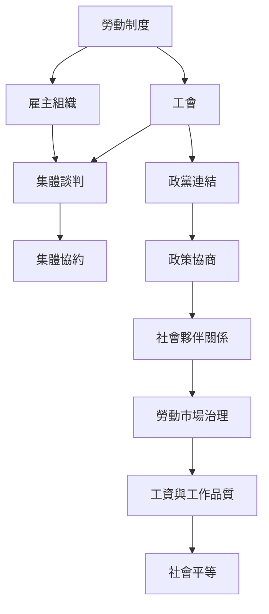

勞動制度不只是勞動法規，也包含勞工能否組織、談判及參與政策。政黨、工會、雇主組織與國家之間的關係，會影響工資分配、工作品質及福利改革的持續性。

```mermaid
flowchart TD
    A[勞動制度] --> B[工會]
    A --> C[雇主組織]
    B --> D[集體談判]
    C --> D
    D --> E[集體協約]
    B --> F[政黨連結]
    F --> G[政策協商]
    G --> H[社會夥伴關係]
    H --> I[勞動市場治理]
    I --> J[工資與工作品質]
    J --> K[社會平等]
```

延伸閱讀：[[集體談判]]、[[社會夥伴關係]]、[[工會與政黨的組織力量共同決定改革能否持續]]、[[政黨若失去組織連結就容易把勞工變成選舉客群]]。
