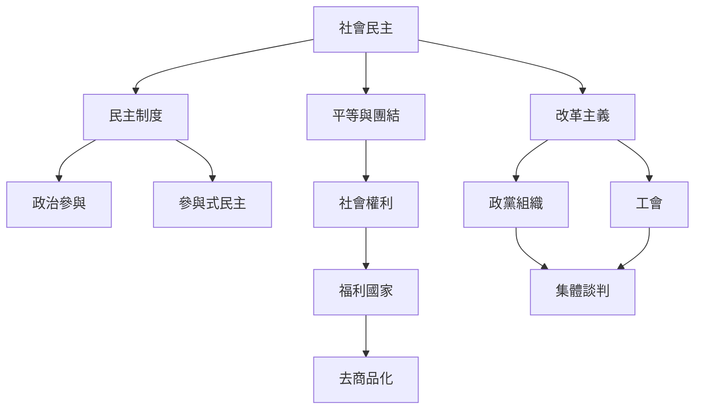

社會民主的思想脈絡由民主、平等、自由與團結構成，並透過改革主義、政黨組織和公民參與轉化為制度。它不是單一政策清單，而是持續協調政治權力、經濟制度與社會權利的實踐。

```mermaid
flowchart TD
    A[社會民主] --> B[民主制度]
    A --> C[平等與團結]
    A --> D[改革主義]
    B --> E[政治參與]
    B --> F[參與式民主]
    D --> G[政黨組織]
    D --> H[工會]
    C --> I[社會權利]
    I --> J[福利國家]
    J --> K[去商品化]
    G --> L[集體談判]
    H --> L
```

延伸閱讀：[[社會民主]]、[[民主社會主義]]、[[改革主義]]、[[社會民主以民主政治作為改革的手段也是改革的目的]]、[[工會與政黨的組織力量共同決定改革能否持續]]。
