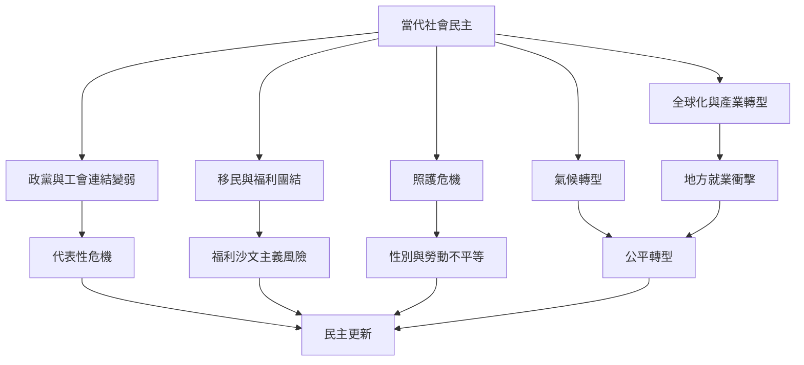

當代社會民主面對政黨選民結構變化、工會力量改變、全球化、移民權利爭議、照護危機與氣候轉型。這些議題彼此交織，不能只用單一的選舉策略解決。

```mermaid
flowchart TD
    A[當代社會民主] --> B[政黨與工會連結變弱]
    A --> C[全球化與產業轉型]
    A --> D[移民與福利團結]
    A --> E[照護危機]
    A --> F[氣候轉型]
    B --> G[代表性危機]
    C --> H[地方就業衝擊]
    D --> I[福利沙文主義風險]
    E --> J[性別與勞動不平等]
    F --> K[公平轉型]
    G --> L[民主更新]
    H --> K
    I --> L
    J --> L
    K --> L
```

延伸閱讀：[[社會民主政黨的工會連結會隨選民結構與制度環境改變（2024）]]、[[福利團結可以建立在共同制度而非族群同質性之上]]、[[照護權與照護工作者的勞動權必須一起保障]]、[[公平轉型要把受衝擊者變成政策共同設計者]]。
