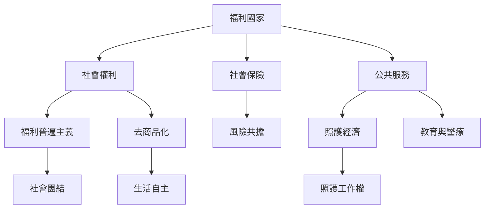

福利國家透過現金給付、社會保險與公共服務分攤生命風險。分析其社會民主特徵時，應同時看權利普遍性、去商品化、實際可近性與分配效果。

```mermaid
flowchart TD
    A[福利國家] --> B[社會權利]
    A --> C[社會保險]
    A --> D[公共服務]
    B --> E[福利普遍主義]
    B --> F[去商品化]
    C --> G[風險共擔]
    D --> H[照護經濟]
    D --> I[教育與醫療]
    E --> J[社會團結]
    F --> K[生活自主]
    H --> L[照護工作權]
```

延伸閱讀：[[福利國家]]、[[社會權利]]、[[去商品化]]、[[福利普遍主義]]、[[社會保險]]、[[照護經濟]]。
