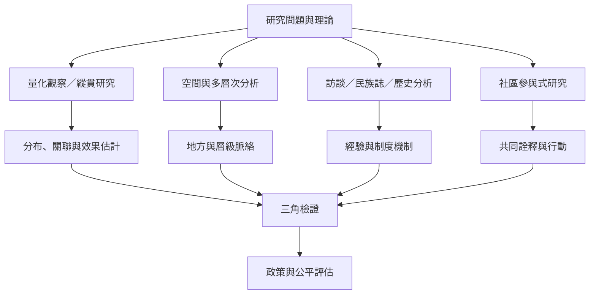

社會流行病學需要在不同尺度與時間上建立可信的解釋。量化研究估計分布與關聯，縱貫資料辨識生命歷程，空間分析呈現地方聚集，質性與歷史研究揭示制度機制，參與式研究則讓受影響社群共同定義問題與解釋結果。

```mermaid
flowchart TD
  A[研究問題與理論] --> B[量化觀察／縱貫研究]
  A --> C[空間與多層次分析]
  A --> D[訪談／民族誌／歷史分析]
  A --> E[社區參與式研究]
  B --> F[分布、關聯與效果估計]
  C --> G[地方與層級脈絡]
  D --> H[經驗與制度機制]
  E --> I[共同詮釋與行動]
  F --> J[三角檢證]
  G --> J
  H --> J
  I --> J
  J --> K[政策與公平評估]
```

概念連結：[[社會流行病學]]、[[地方效應]]、[[生命歷程流行病學]]、[[健康監測]]、[[交織性]]。

全書導讀：[[Social_epidemiology]]。
