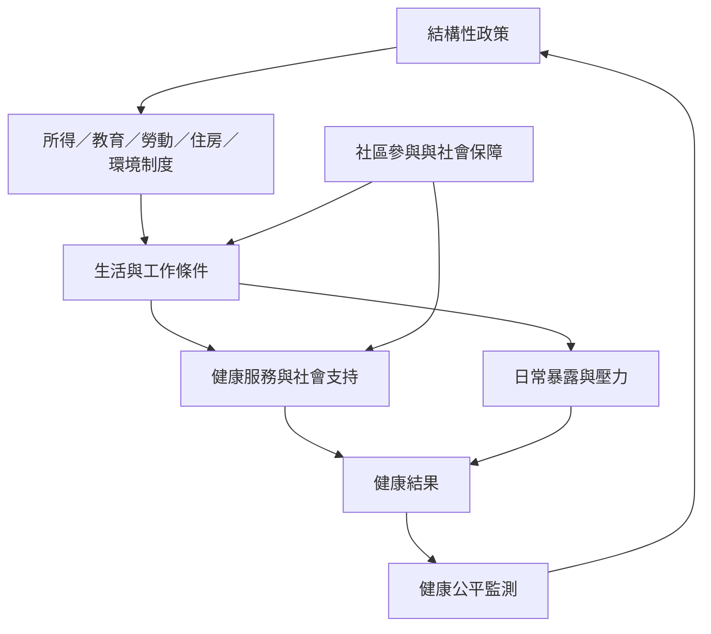

政策介入可發生於不同位置：直接改善醫療可近性，改變日常生活條件，或重分配產生社會位置的權力與資源。越上游的政策越可能改變多種健康結果，但也需要跨部門治理與較長時間評估。

```mermaid
flowchart TD
  A[結構性政策] --> B[所得／教育／勞動／住房／環境制度]
  B --> C[生活與工作條件]
  C --> D[健康服務與社會支持]
  C --> E[日常暴露與壓力]
  D --> F[健康結果]
  E --> F
  G[社區參與與社會保障] --> C
  G --> D
  H[健康公平監測] --> A
  F --> H
```

概念連結：[[結構性決定因素]]、[[中介性決定因素]]、[[健康公平]]、[[普遍主義與比例原則]]、[[人口策略]]、[[健康的政治經濟學]]。

全書導讀：[[Social_epidemiology]]。
